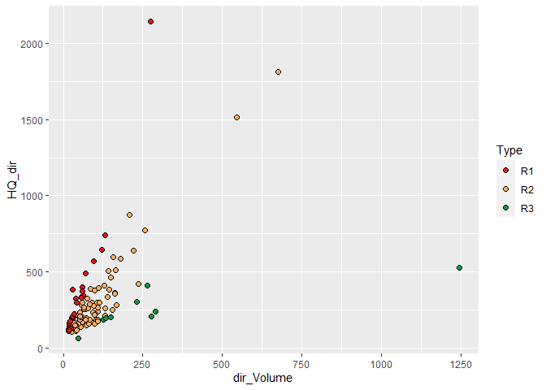
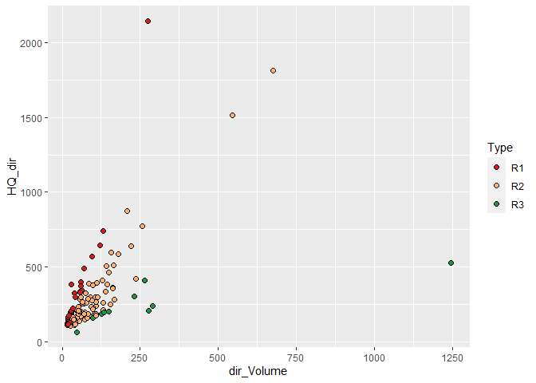

<!-- README.md is generated from README.Rmd. Please edit that file -->

# FloodR

## Description
This package provides tools for:
* Separation of flood events from discharge timeseries
* Spatial interpolation of precipitation
* Separation of storm events from precipitation timeseries
* Flood event typology
    + Typing of rain events by TQ-Value
    + Typing of snow events by clustering
* TMPS: Floodtype-based Mixture Model of Partial Duration Series TMPS 
    + typewise statistical estimate of return periods
    + typewise statistical estimate of quantiles


## Installation and Usage
First, install the newest version of Floodr from GitHub
``` r
devtools::install_github(repo = "PhilippBuehler/FloodR")
```

### Separation of Flood events

``` r
library("FloodR")
```

    ## Warning: replacing previous import 'data.table::shift' by 'spatstat::shift' when
    ## loading 'FloodR'

``` r
# Create a data.frame with continuous daily discharge
dailyMQ <- data.frame(Date=seq(from=as.Date("01.01.2000", format="%d.%m.%Y"),
  to=as.Date("01.01.2004", format="%d.%m.%Y"), by="days"),
  discharge=rbeta(1462,2,20)*100)

# Create a data.frame with monthly maximum peak values
monthlyHQ <- data.frame(Date=seq(from=as.Date("01.01.2000", format="%d.%m.%Y"),
  to=as.Date("01.01.2004", format="%d.%m.%Y"), by="months"),
  discharge=dailyMQ$discharge[(0:48)*12+1]+rnorm(49,5,1))

#Run the separation
Flood_events <- eventsep(dailyMQ, monthlyHQ)
head(Flood_events)
```

    ##        Begin        End  Peak_date  DailyMQ    Volume dir_Volume baseflow_peak
    ## 1 2000-01-14 2000-01-19 2000-01-17 16.58258  4.140737  3.2349705      2.235805
    ## 2 2000-01-24 2000-01-30 2000-01-29 26.40476  6.205777  5.1118017      2.417955
    ## 3 2000-01-24 2000-01-29 2000-01-26 14.18981  3.924406  3.0127595      2.017994
    ## 4 2000-01-28 2000-01-30 2000-01-29 23.83298  2.281371  2.0591691      1.285893
    ## 5 2000-02-22 2000-02-29 2000-02-29 33.72785 10.474443 -0.6745755     33.727846
    ## 6 2000-03-01 2000-03-20 2000-03-05 18.89600 14.903041 10.7933008      2.099632
    ##   baseflow_begin baseflow_end No_Peaks HQ HQ_dir    Comments
    ## 1       1.401067     2.792297        1 NA     NA            
    ## 2       1.648800     2.571786        1 NA     NA            
    ## 3       1.648800     2.571786        1 NA     NA  first wave
    ## 4       0.000000     2.571786        1 NA     NA second wave
    ## 5       3.140602    33.727846        1 NA     NA            
    ## 6       1.805912     3.201082        1 NA     NA

``` r
# The Separation might still contain overlaid flood events which need to be corrected
```

### Correction of Flood events

``` r
# Run the Web separation on the dummy Catchment
# As input to the function a minimum of discharge data is used. The Flood event tables can be opened from within the User-Interface
library("FloodR")

Run_WebFlood()
```

### Separation of Precipitation

``` r
# After the flood events are corrected (if needed), the precipitation belonging to flood event need to be estimated
# For the both functions, a daily precipitation timeseries is needed, as well as  the parameter indT, which has the position indices of begin, end and peak of the FLOOD event as vector.
library("FloodR")

dailyprec <- data.frame(Date=seq(from=as.Date("01.01.2000", format="%d.%m.%Y"),
  to=as.Date("30.04.2000", format="%d.%m.%Y"), by="days"),
  discharge=rbeta(121,2,20)*100)
indT <- c(15,30,14+which.max(dailyprec[15:30,2]))

Date1 <- PreconeCP(dailyprec, indT = indT)
Date2 <- PrectwoCP(dailyprec, indT = indT)
print(c("Method1" = Date1, "Method2" = Date2))
```

    ##      Method1      Method2 
    ## "2000-01-15" "2000-01-04"

### Typing of flood events

``` r
# Open the sample flood event data
library("FloodR")

data("Sample_Flood_events")
head(Sample_Flood_events)
```

    ##        Begin        End  Peak_date Sum_SM  Sum_N dir_Volume  HQ_dir PSI_SM
    ## 1 1950-02-10 1950-02-14 1950-02-11   0.73  14.81      18.45  146.02   0.22
    ## 2 1951-01-18 1951-01-26 1951-01-20   1.37  38.45      26.56  108.25   0.12
    ## 3 1952-09-12 1952-09-18 1952-09-14   0.09  68.45      22.05  142.18   0.06
    ## 4 1953-01-28 1953-02-11 1953-01-30  28.68  52.64     124.25  353.18   0.28
    ## 5 1953-02-19 1953-03-04 1953-02-23  17.05   6.27     113.31  209.12   0.89
    ## 6 1954-07-08 1954-07-24 1954-07-10   0.09 197.43     545.35 1513.91   0.50
    ##    TQDir SM_rel       HQ
    ## 1  35.10   0.05  171.622
    ## 2  68.15   0.03  130.075
    ## 3  43.08   0.00  167.398
    ## 4  97.72   0.35  399.498
    ## 5 150.51   0.73  241.032
    ## 6 100.06   0.00 1676.301

``` r
# Type the floods
# We need a Flood table with at least the following columns:
# Sum_SM: Sum of snowmelt during the floodevent in mm
# Sum_N: Sum of precipitation during the floodevent in mm
# dir_Volume: Direct volume of the flood event (Volume minus baseflow) in Mio. m³/s
# HQ_dir: Direct peak (instantaneous flood peak minus baseflow) in m³/s
# PSI_SM: Runoff coefficient of the flood event WITH snowmelt+precipitation

Floods_typed <- Flood_typology(Floods = Sample_Flood_events, n_G = 3, Type_3_min_samplesize = 10)

table(Floods_typed$Type)
```

    ## 
    ## R1 R2 R3 S1 S2 
    ## 30 75  9 26  9

``` r
Floods_Rain <- Floods_typed[Floods_typed$Type %in% c("R1", "R2", "R3"),]

library(ggplot2)
ggplot(Floods_Rain)+
  geom_point(aes(x=dir_Volume, y=HQ_dir, fill=Type), colour="black", shape=21, size=2)+
  scale_fill_manual(values = c("R1"="#D7191C", "R2"="#FDAE61", "R3"= "#1A9641"))
```



### Typewise and combined return period estimation with the SMPS model

``` r
# Open the discharge data
library("FloodR")

data("Discharge")
head(Discharge)
```

    ##          Date Discharge
    ## 1: 1950-01-01  144.2951
    ## 2: 1950-01-02  140.8438
    ## 3: 1950-01-03  143.0167
    ## 4: 1950-01-04  151.4559
    ## 5: 1950-01-05  145.1900
    ## 6: 1950-01-06  141.6746

``` r
Floods_typed <- Floods_typed[, c("Peak_date","HQ", "Type")]


SMPS_results <- SMPS_model(Floods_typed, Discharge, return_types = c("SMPS", "R1", "R2", "R3", "S1", "S2"))


# Calculate the AMS with TWO SIMPLIFICATIONS FOR EASYNESS : 
# 1) no hydrological years 
# 2) asummption instantaneous peaks == annual max of daily discharge * 1.1

AMS <- aggregate((Discharge$Discharge*1.1), list(as.numeric(format(Discharge$Date,"%Y"))), max, na.rm=TRUE)$x

suppressMessages(library(fExtremes))
library(reshape2)
AMS_params <- gevFit(AMS, type="pwm")@fit$par.ests  
AMS <- qgev(1-1/c(2,5,10,20,25,50,100,200,500,1000), mu=AMS_params[2], xi=AMS_params[1], beta=AMS_params[3])

Results <- as.data.frame(rbind(SMPS_results, AMS=AMS))
Results[Results < 0] <- NA
Results <- cbind(Results, "Method"=rownames(Results))
Results_melt <- melt(Results, id.vars = "Method", variable.name = "Annuality")
Results_melt$Annuality <- as.numeric(as.character(Results_melt$Annuality))

cols <- c("AMS"="black",c(R1 = "#D7191C", R2 = "#FDAE61", R3 = "#1A9641", S1 = "#6BAED6", S2 = "#2171B5"),  "SMPS"="darkorchid1")

ggplot(Results_melt)+ 
  theme_bw()+
  geom_line(aes(x=Annuality, y=value, colour = Method ), size=1.5)+ 
  scale_color_manual(values=cols)+
  scale_x_log10()+
  labs(x="T[a]",y="Peak discharge [m³/s]")+
  annotation_logticks(sides = "b")
```

    ## Warning: Removed 5 row(s) containing missing values (geom_path).


